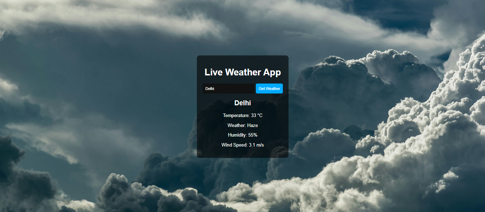

# PRODIGY_WD_05
# Weather App

This is a simple web-based Weather app application built with HTML, CSS, and JavaScript. The app allows user to get live Weather of any place using API.



## Table of Contents

- [Features](#features)
- [Installation](#installation)
- [Usage](#usage)
- [Project Structure](#project-structure)
- [Customization](#customization)
- [Contributing](#contributing)
- [License](#license)
- [Contact](#contact)

## Features

- Interactive Interface .
- Clean and minimalistic UI  .
- Live Weather update using API.
- Footer with social media links.

## Installation

1. Clone the repository:

   ```sh
   git clone https://github.com/Tanmay4409/PRODIGY_WD_05.git
   ```

2. Navigate to the project directory:

   ```sh
   cd PRODIGY_WD_05
   ```

3. Open the `index.html` file in your preferred web browser.

## Usage

1. Click the **Reset** button to reset the Board.
2. Click the **New game** button to Start a new game.
3. Click the **2 User** button to Go to 2 player vs player mode.
4. Click the **User vs Bot** button to Single player mode vs bot.

## Project Structure

```plaintext
PRODIGY_WD_05/
│ 
├── background.png
├── License
├── screenshot.png
├── style.css
├── script.js
└── index.html
```

- `style.css`: Contains the styles for the project.
- `script.js`: Contains the JavaScript code for the stopwatch functionality.
- `index.html`: The main HTML file for the project.

## Customization

You can customize the project by modifying the HTML, CSS, and JavaScript files as needed.

- **HTML**: Update the `index.html` file to change the structure or content of the page.
- **CSS**: Update the `style.css` file to change the styles.
- **JavaScript**: Update the `script.js` file to change the functionality.

## Contributing

Contributions are welcome! Please feel free to submit a Pull Request or open an Issue if you have any suggestions or improvements.

## License

This project is licensed under the MIT License. See the [LICENSE](LICENSE)  for more details.

## Contact

- **LinkedIn**: [Tanmay Patil](https://www.linkedin.com/in/tanmay-patil-98b030258/)
- **Instagram**: [@t_nmaypatil](https://www.instagram.com/t_nmaypatil/?igsh=MXN2NGg0dGF4aXNkeA%3D%3D)
- **GitHub**: [Tanmay4409](https://github.com/Tanmay4409)

---

Feel free to update the README content as per your project requirements and preferences.
